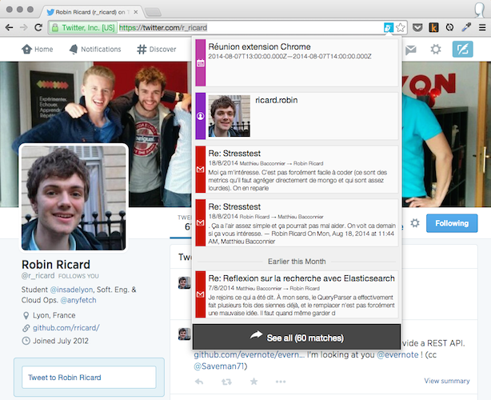

anyfetch-chrome
===============

AnyFetch Chrome extension

# Get it on the Chrome Web Store!

The app is available [right there](https://chrome.google.com/webstore/detail/anyfetch/igbnmifdfpgnbdhcnhiadcggoejocfpn).

## How to work locally

1. `npm install`
2. `npm install -g gulp`
3. `gulp`

In order to add a local, unpacked extension to Chrome, go to your Extension management page. Activate the "Developer mode" and use the "Load unpacked extension" button.

The `gulp` command will automatically start watching for changes in you files and rebuild as necessary. Building compiles the LESS files to CSS and assemble the JavaScript modules into a single file using Browserify.

## How to package the app

1. `npm version v1.x.x`
2. `gulp package`

A zip containing all the necessary files and folders is created at the project's root. Note that the version number is read from `package.json` and updated in `manifest.json` automatically.

The zip can be uploaded directly to the Web Store. To push the new version to the Chrome Web Store, follow [this procedure](https://developer.chrome.com/webstore/publish).

## Interesting reads

- [Chrome extension architecture overview](https://developer.chrome.com/extensions/overview)
- [Browser actions](https://developer.chrome.com/extensions/browserAction) VS [Page actions](https://developer.chrome.com/extensions/pageAction)
